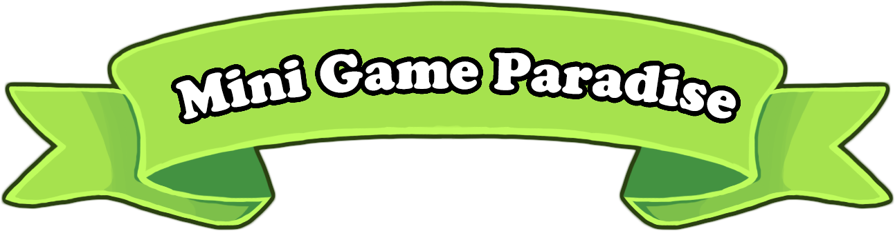
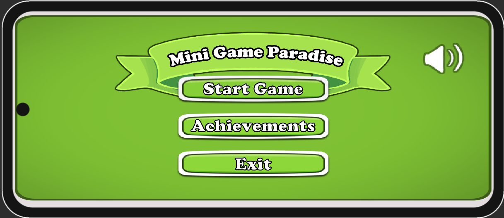
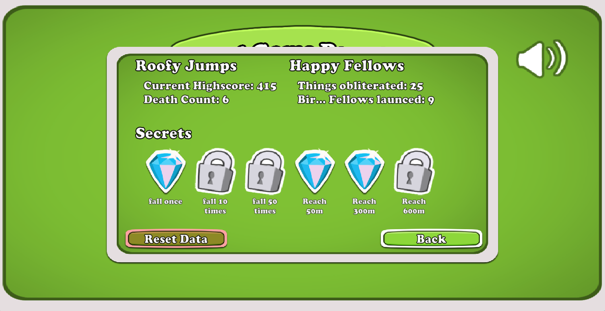
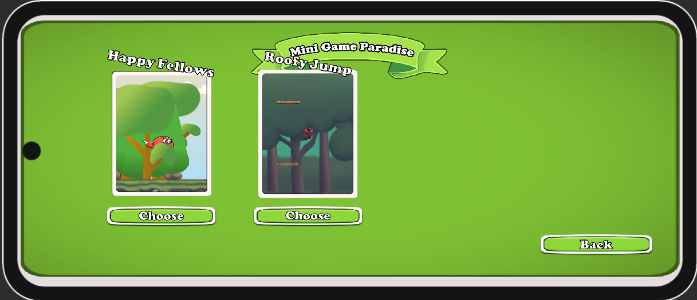
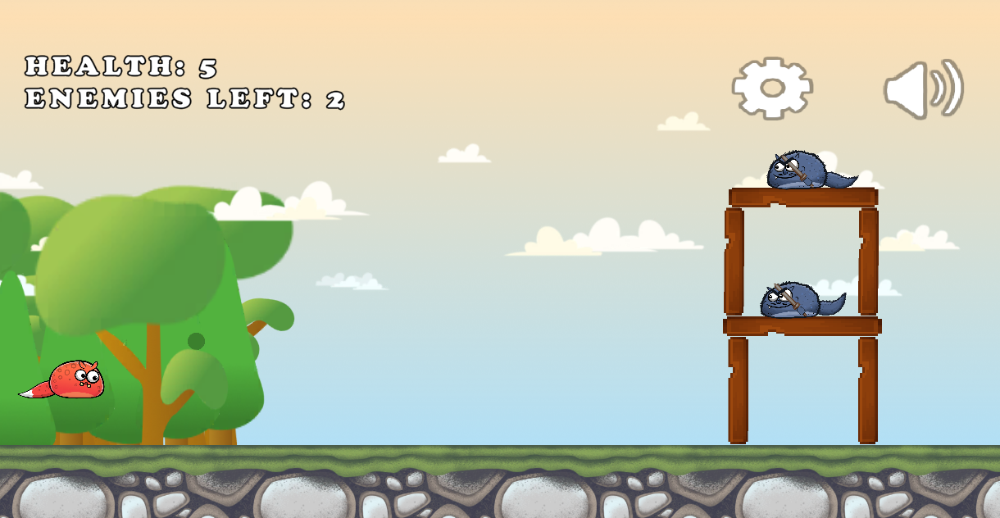
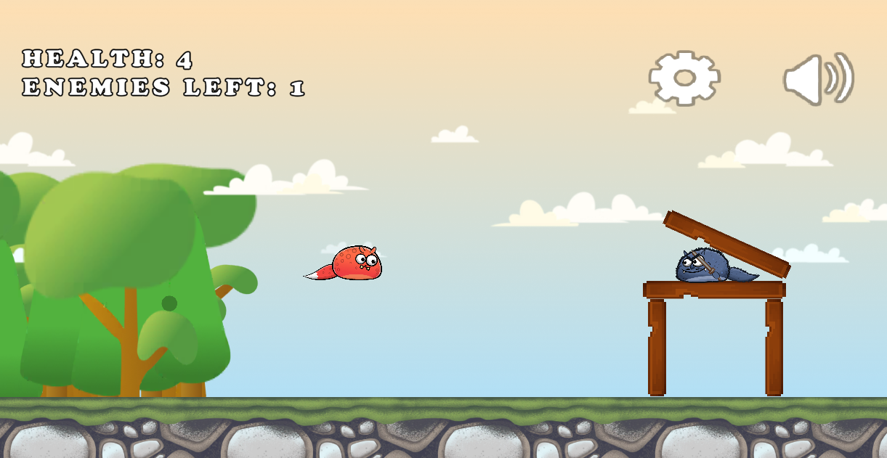
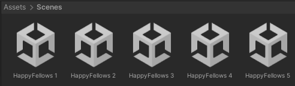
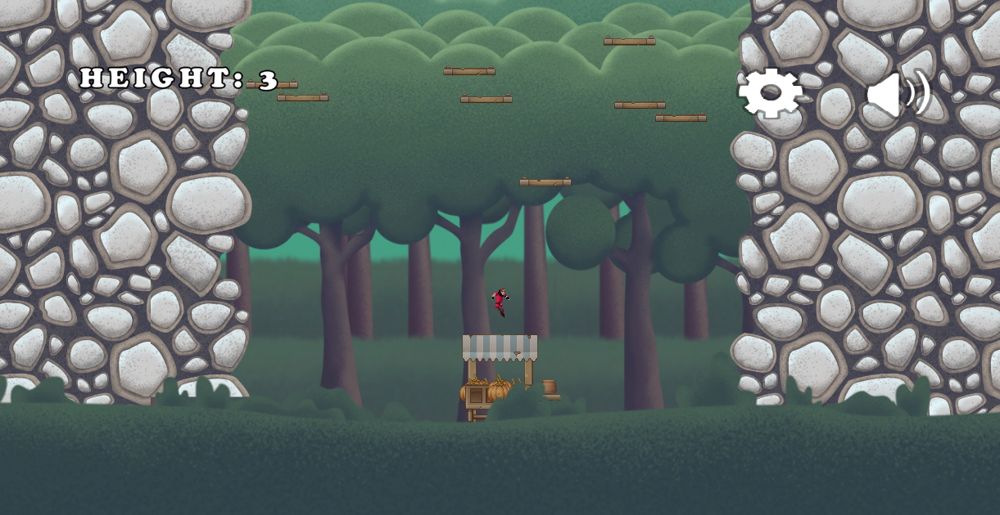
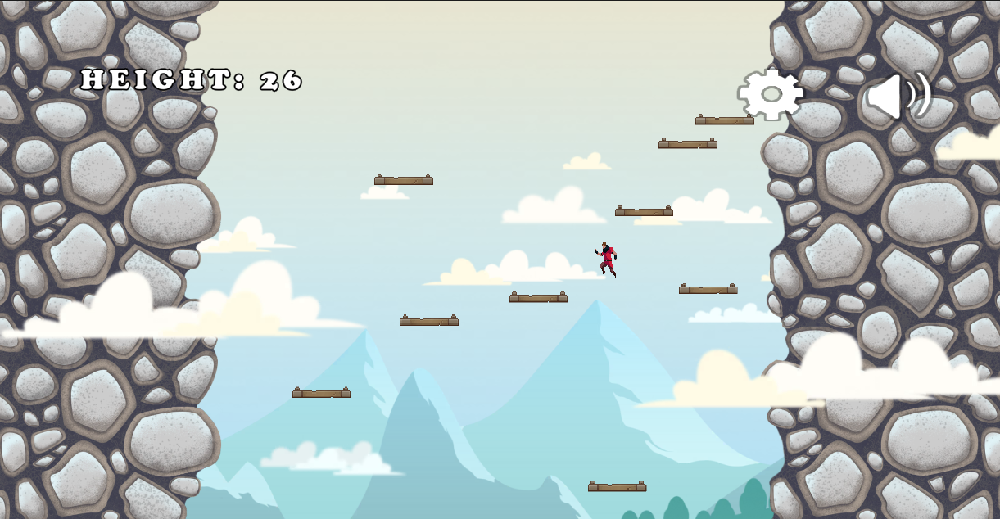
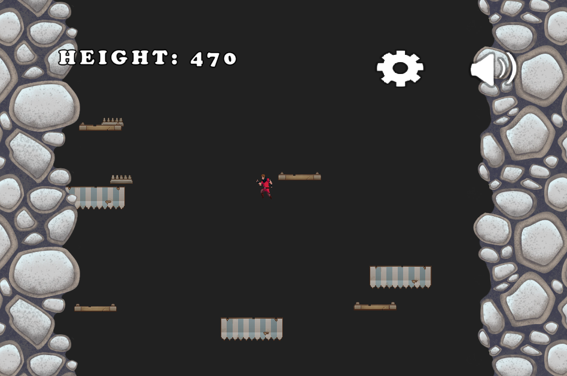

# MiniGameParadise MGP 
 A small mobile game with two "extremely unique" games.

## Game features:

#### Simple intuitive UI (includes options / mute button etc.)

#### Achievements!

#### Game selection menu

## Game 1 - Happy Fellows (could aswell include a red angry bird, but doesn't.)

### Pull...

### Release, Destroy and drop the ~~pigs~~ fellows.

### Includes 5 hand crafted maps

## Game 2 - Roofy Jump (something something doodle)
### Start jumping

### The higher you go...

### The harder (and darker) it gets. 
### Features different types of platforms that you can use, but be careful not all of them are helpful.

> [!CAUTION]
> THE PROJECT DOES NOT CONTAINT THE USED ASSETS. Read below.

### In order to run the project, you need to download the used assets and drop them into the "assets"-folder. The asset packs used:
- [2D Casual UI HD by MiMU STUDIO](https://assetstore.unity.com/packages/2d/gui/icons/2d-casual-ui-hd-82080)
- [2D Forest Tileset Pack Toon Style by DinV Studio](https://assetstore.unity.com/packages/2d/environments/2d-forest-tileset-pack-toon-style-93499)
- [Pixel Art Platformer - Village Props by Cainos](https://assetstore.unity.com/packages/2d/environments/pixel-art-platformer-village-props-166114)
- [Cute Pets 2D (FREE) by SR Studios Kerala](https://assetstore.unity.com/packages/2d/characters/cute-pets-2d-free-239180)
- [Medieval Warrior Pack 2 by Luiz Melo](https://assetstore.unity.com/packages/2d/characters/medieval-warrior-pack-2-174788)

> [!NOTE]
> Also there is no background music assets since, I did not own any rights to the background music I originally used. 

## HOW-TO-USE:
Simply clone the repository and download the assets listed above, drop them into the "assets"-folder. Might need to do some configuring with the prefabs etc., also need to drop the wanted background music into the "MusicSource". Tried to make the code as self-explainatory as possible.
